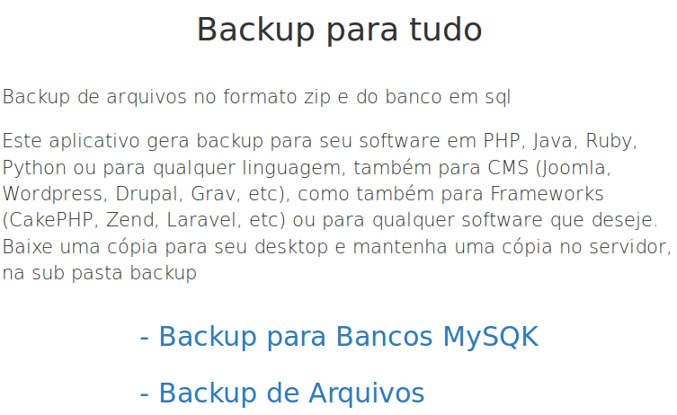
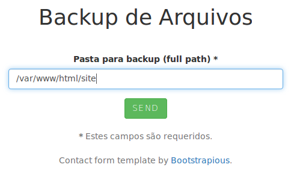
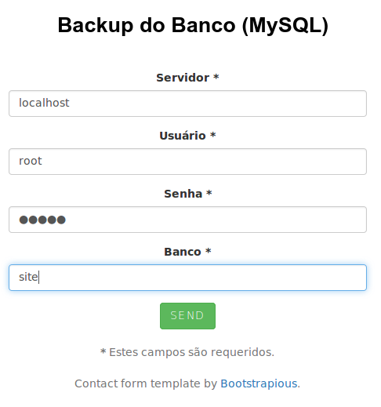

# Backup Genérico

Help in English - [Click here](https://github.com/ribafs/generic-backup/blob/master/README-english.md)

Empacota todos os arquivos de de um software (sua pasta e subpastas) para o formato zip e exporta todo um banco de dados MySQL para um arquivo .sql, faz isso para qualquer aplicação ou site, independente da linguagem.

## Download
https://github.com/ribafs/generic-backup

## Permissão da sub pasta backup

A sub pasta "backup" requer permissão de escrita para o usuário do servidor web.

**Como usar**

Efetue o download para o servidor e descompacte numa pasta visível pelo servidor web.

**Sem qualquer Configuração**

Apenas descompacte, chame pelo navegador e use.

**Idiomas**

Suporta dois idiomas: português e inglês (detectado pelo navegador via JavaScript).

**Veja algumas capturas**

Index

arquivos

Após compactar ele faz o backup na pasta "backup" com o nome mais dia, mês, ano e hora e mostra um link para download de uma cópia.

Database

Após o backup joga uma cópia para a pasta "backup" e oferece um link para download também.

**License**

GPL 3
